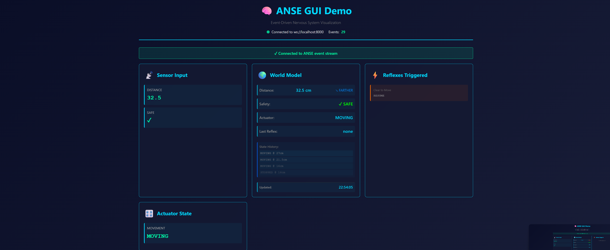
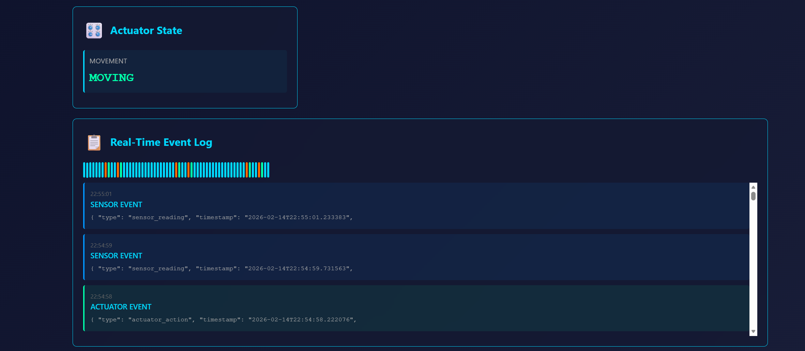

# ANSE Dashboard - Screenshots & Visual Guide

This file documents the ANSE Dashboard UI and shows how the nervous system works in action.

> **📸 Add your screenshots:** 
> 1. Save PNG/JPG files to `/docs/screenshots/` folder
> 2. Update `/docs/screenshots/INDEX.md` with filename and description
> 3. Reference with markdown: ``

**Screenshot tracking:** See [docs/screenshots/INDEX.md](docs/screenshots/INDEX.md)

---

## Dashboard Panels

The ANSE Dashboard displays real-time events from the nervous system. Here's what each panel shows:

### 1. Sensor Panel
**What it shows:** Real-time sensor readings from the nervous system

```
Sensor readings update every 1-2 seconds
Shows: sensor_name, sensor_type, value, timestamp

Example:
  Sensor: distance_sensor
  Type: distance
  Value: 42.5 cm
  Time: 2026-02-14 12:34:56.789Z
```



---

### 2. Actuator Panel
**What it shows:** Current state of motors and actuators

```
Updates when motors change state
Shows: actuator_name, actuator_type, state, timestamp

Example:
  Actuator: movement
  Type: motor
  State: MOVING
  Time: 2026-02-14 12:34:56.789Z
```


---

### 3. World Model Panel
**What it shows:** The agent's brain state — how it interprets the world

```
The brain's interpretation of sensor data
Shows: interpreted_state, danger_level, last_reflex, event_count

Example:
  Distance: 42.5 cm
  Safe: true
  Actuator State: MOVING
  Last Reflex: clear_to_move
  Total Events: 127
```


---

### 4. Reflex Panel
**What it shows:** Which safety rules have been triggered

```
Shows automatic reflex reactions
Shows: reflex_name, condition, triggered, timestamp

Example:
  Reflex: proximity_safeguard
  Rule: distance < 10cm
  Triggered: YES
  Time: 2026-02-14 12:34:56.789Z
```


---

### 5. Event Log
**What it shows:** Complete chronological record of all events

```
Shows every event that occurred
Sensor → World Model → Reflex → Actuator

Timeline:
  12:34:56.100Z [sensor]    distance_sensor reading: 50cm
  12:34:56.102Z [worldmodel] interpreted: safe=true
  12:34:56.103Z [actuator]   movement: MOVING
  12:34:57.200Z [sensor]    distance_sensor reading: 42.5cm
  12:34:57.205Z [worldmodel] interpreted: safe=true
  ...
```



---

## Example Nervous System Flow (Visual)

When a sensor reading changes, the nervous system flows through phases:

```
TIME: 12:34:57.000Z
──────────────────

1️⃣ SENSOR PHASE
   Distance sensor emits: 8.5cm
   
2️⃣ WORLD MODEL
   Brain receives reading
   Interprets: safe = false (danger detected!)
   
3️⃣ REFLEX PHASE
   Check rule: distance < 10cm?
   YES → Trigger "proximity_safeguard"
   
4️⃣ ACTUATOR PHASE
   Execute action: STOP movement
   
5️⃣ BROADCAST
   Send events to Dashboard:
   • sensor event
   • worldmodel update
   • reflex trigger
   • actuator command
   
6️⃣ DASHBOARD
   All 5 panels update in real-time
   Event appears in Event Log
   
TIME: 12:34:57.150Z (entire cycle: 150ms)
```

---

## How to Add Screenshots

### Step 1: Capture the Dashboard
1. Start backend: `python backend/websocket_backend.py`
2. Start dashboard: `cd dashboard && python -m http.server 8002`
3. Open browser: `http://localhost:8002/`
4. Let it run for 30 seconds to collect events
5. Take screenshot of browser (with panels visible)

### Step 2: Save to correct location
- **Save as:** `/docs/screenshots/sensor-panel.png` (or similar)
- **Format:** PNG or JPG
- **Name:** Use descriptive names

### Step 3: Update INDEX.md
1. Open `docs/screenshots/INDEX.md`
2. Add your screenshot filename and description to the table
3. Save the file

### Step 4: Reference in SCREENSHOTS.md
Once tracked in INDEX.md, add the image reference here:
```markdown

```

---

## Screenshots to Add

**See detailed list in:** [`docs/screenshots/INDEX.md`](docs/screenshots/INDEX.md)

Current status:
- 📁 Directory created: `/docs/screenshots/`
- 📝 Tracking file ready: `/docs/screenshots/INDEX.md`
- ⏳ Ready for your screenshots!

---

## Architecture Visualization

### System Architecture Diagram

```
┌─────────────────────────────────────────────────────┐
│ ANSE Nervous System                                 │
├─────────────────────────────────────────────────────┤
│                                                     │
│  1. SENSORS              2. WORLD MODEL            │
│  ├─ Distance             ├─ Current state         │
│  ├─ Temperature          ├─ Interpreted danger   │
│  └─ Proximity            └─ Event history        │
│         ▼                       △                  │
│    [emit event]         [receive event]            │
│         │                       │                  │
│         └───────────────────────┘                  │
│                   │                                │
│         3. REFLEXES (if condition matches)        │
│         ├─ proximity_safeguard (dist > 10cm)     │
│         ├─ clear_to_move (dist < 15cm)           │
│         └─ overheat (temp > 30°C)                │
│                   │                                │
│         4. ACTUATORS (execute action)             │
│         ├─ movement: STOP/MOVE                   │
│         ├─ cooling: ON/OFF                       │
│         └─ alarm: SILENT/ALERT                   │
│                   │                                │
│         5. BROADCAST to clients                   │
│         └─ WebSocket → Dashboard                 │
│                                                     │
└─────────────────────────────────────────────────────┘
         ▲
         │ ws://localhost:8001 (WebSocket)
         │
┌─────────────────────────────────────────────────────┐
│ Dashboard (Browser)                                 │
├─────────────────────────────────────────────────────┤
│                                                     │
│  [Sensor Panel]    [Actuator Panel]               │
│  ├─ Distance        └─ State: MOVING              │
│  └─ 42.5cm                                        │
│                                                     │
│  [World Model]     [Reflex Panel]                 │
│  ├─ Safe: true      └─ Last: clear_to_move      │
│  └─ Events: 127                                   │
│                                                     │
│  ┌────────────────────────────────────────────┐  │
│  │         EVENT LOG (streaming)              │  │
│  ├────────────────────────────────────────────┤  │
│  │ 12:34:57.100 [sensor] distance: 42.5cm    │  │
│  │ 12:34:57.102 [world]  safe: true          │  │
│  │ 12:34:57.103 [reflex] clear_to_move       │  │
│  │ 12:34:57.105 [actuator] MOVING            │  │
│  └────────────────────────────────────────────┘  │
│                                                     │
└─────────────────────────────────────────────────────┘
```

---

## Sample Event Sequences

### Sequence 1: Object Approaches → Danger Detected → Stop

```
Time    Phase         Event
────────────────────────────────────────────────────
12:34:50  [SENSOR]    distance_sensor: 50cm
12:34:50  [WORLD]     interpreted: safe=true
12:34:51  [SENSOR]    distance_sensor: 42.5cm
12:34:51  [WORLD]     interpreted: safe=true
12:34:52  [SENSOR]    distance_sensor: 35cm
12:34:52  [WORLD]     interpreted: safe=true
12:34:53  [SENSOR]    distance_sensor: 22.5cm
12:34:53  [WORLD]     interpreted: safe=true
12:34:54  [SENSOR]    distance_sensor: 8.5cm ⚠️
12:34:54  [WORLD]     interpreted: safe=false 🚨
12:34:54  [REFLEX]    proximity_safeguard: TRIGGERED
12:34:54  [ACTUATOR]  movement: STOPPED
```

### Sequence 2: Object Recedes → Safe Again → Resume Moving

```
Time    Phase         Event
────────────────────────────────────────────────────
12:34:54  [SENSOR]    distance_sensor: 8.5cm
12:34:55  [SENSOR]    distance_sensor: 15cm
12:34:55  [WORLD]     interpreted: safe=true ✓
12:34:55  [REFLEX]    clear_to_move: TRIGGERED
12:34:55  [ACTUATOR]  movement: MOVING
12:34:56  [SENSOR]    distance_sensor: 22.5cm
12:34:56  [WORLD]     interpreted: safe=true
12:34:57  [SENSOR]    distance_sensor: 32.5cm
12:34:57  [WORLD]     interpreted: safe=true
```

---

## Live Dashboard Demo

### Quick Start (30 seconds)

```bash
# Terminal 1
python backend/websocket_backend.py

# Terminal 2
cd dashboard && python -m http.server 8002

# Browser
http://localhost:8002/
```

**You should see:**
- ✅ Panel headers for all 5 components
- ✅ Events appearing every 1-2 seconds
- ✅ Distance values cycling: 50 → 5 → 50
- ✅ Actuator state changing: IDLE → STOPPED → MOVING
- ✅ Event log growing in real-time

**If dashboard is blank:**
1. Check browser console (F12)
2. Verify WebSocket connects to `ws://localhost:8001`
3. Check backend is running with "Waiting for connections..."

---

## Customization Examples

### Change Dashboard Theme
Edit `/dashboard/css/styles.css`:
```css
:root {
  --primary-color: #007ACC;   /* VS Code blue */
  --danger-color: #FF6B6B;    /* Danger red */
  --success-color: #51CF66;   /* Success green */
}
```

### Show/Hide Panels
Edit `/dashboard/js/app.js`:
```javascript
const panels = {
  sensor: true,          // Show sensor panel
  actuator: true,        // Show actuator panel
  worldmodel: true,      // Show world model panel
  reflex: true,          // Show reflex panel
  eventlog: true         // Show event log
};
```

### Change Event Colors
Edit `/dashboard/css/panels.css` to customize event colors:
```css
.event-sensor { color: #007ACC; }    /* Blue for sensors */
.event-reflex { color: #FF9E1B; }    /* Orange for reflexes */
.event-actuator { color: #51CF66; }  /* Green for actuators */
```

---

## Troubleshooting Screenshots

### Problem: Dashboard shows blank white screen
**Solution:**
- Check backend running: `ps aux | grep websocket_backend`
- Check WebSocket connection in browser F12 → Network tab
- Verify no JavaScript errors in browser console

### Problem: Panels appear but no events
**Solution:**
- Backend not broadcasting? Check logs
- Enable debug mode: `debug=True` in backend
- Check WebSocket is receiving messages in F12 Network tab

### Problem: Events flowing but panels not updating
**Solution:**
- Check browser console for JavaScript errors
- Verify panel divs have correct IDs (sensor-panel, actuator-panel, etc.)
- Hard refresh: Ctrl+Shift+R

---

## Using This File

1. **Before screenshots exist:** Shows what to expect
2. **During testing:** Document what you're seeing
3. **For documentation:** Visual guide for README/wiki
4. **For bug reports:** Attach panel screenshots showing the issue

---

*ANSE Dashboard - Visual guide to the nervous system in action.* ✨
